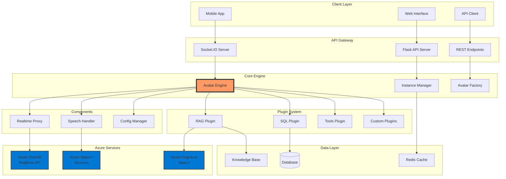

# 🏭 Avatar Factory - Production-Ready AI Avatar System

<div align="center">


**Transform your AI interactions with customizable, production-ready avatars powered by Azure OpenAI Realtime API and Azure Speech Services**

[Features](#features) • [Quick Start](#quick-start) • [Architecture](#architecture) • [Documentation](#documentation) • [Examples](#examples)

</div>

## 📋 Table of Contents

- [Overview](#overview)
- [Features](#features)
- [Architecture](#architecture)
- [Quick Start](#quick-start)
- [Installation](#installation)
- [Creating Avatars](#creating-avatars)
- [Configuration](#configuration)
- [API Reference](#api-reference)
- [Deployment](#deployment)
- [Examples](#examples)
- [Contributing](#contributing)

## 🎯 Overview

Avatar Factory is a comprehensive system for creating and managing AI-powered avatars with real-time voice and visual interaction capabilities. Built on Azure's cutting-edge AI services, it provides a modular, scalable architecture for deploying custom AI assistants across various domains.

### Key Capabilities

- **🎭 Customizable Avatars**: Create unique AI personas with distinct personalities, voices, and appearances
- **🔊 Real-time Voice Interaction**: Powered by Azure OpenAI Realtime API with natural speech synthesis
- **🧠 RAG Integration**: Built-in Retrieval Augmented Generation for knowledge-based responses
- **🔌 Plugin System**: Extensible architecture with SQL, tools, and custom plugin support
- **🏗️ Factory Pattern**: Create new avatar instances in seconds from templates
- **🚀 Production Ready**: Docker support, health checks, metrics, and monitoring

## ✨ Features

### Core Features

- **Azure OpenAI Realtime API Integration**
  - WebSocket-based real-time communication
  - Server-side VAD (Voice Activity Detection)
  - Automatic speech recognition and synthesis
  - Function calling support

- **Azure Speech Avatar Support**
  - High-quality 3D avatars
  - Lip-sync and facial expressions
  - Multiple character styles
  - Custom backgrounds

- **Modular Plugin System**
  - RAG Plugin for knowledge base integration
  - SQL Plugin for database queries
  - Tools Plugin for custom functions
  - Easy plugin development

- **Multi-Instance Management**
  - Run multiple avatars simultaneously
  - Instance isolation and configuration
  - Dynamic loading and unloading
  - Resource management

### Technical Features

- **WebRTC Support** for low-latency video/audio
- **Socket.IO** for real-time bidirectional communication
- **Automatic Reconnection** with exponential backoff
- **Comprehensive Error Handling**
- **Performance Metrics** and monitoring
- **Docker Containerization**
- **REST API** and WebSocket interfaces

## 🏗️ Architecture



### Component Descriptions

| Component | Description |
|-----------|-------------|
| **Avatar Engine** | Core orchestrator managing avatar lifecycle and communication |
| **Instance Manager** | Handles multiple avatar instances and resource allocation |
| **Avatar Factory** | Creates and configures new avatar instances from templates |
| **Realtime Proxy** | WebSocket proxy for Azure OpenAI Realtime API |
| **Speech Handler** | Manages Azure Speech Services for TTS and avatars |
| **Plugin System** | Extensible plugin architecture for custom functionality |

## 🚀 Quick Start

### 1. Clone and Setup

```bash
# Clone the repository
git clone https://github.com/your-org/avatar-factory.git
cd avatar-factory

# Install dependencies
pip install -r requirements.txt

# Copy environment template
cp .env-template .env
```

### 2. Configure Azure Services

Edit `.env` with your Azure credentials:

```env
# Azure OpenAI
AZURE_OPENAI_ENDPOINT=https://your-resource.openai.azure.com/
AZURE_OPENAI_API_KEY=your-api-key
AZURE_OPENAI_DEPLOYMENT=gpt-4o-realtime-preview

# Azure Speech Services
SPEECH_KEY=your-speech-key
SPEECH_REGION=westus2

# Azure Cognitive Search (optional)
COGNITIVE_SEARCH_ENDPOINT=https://your-search.search.windows.net
COGNITIVE_SEARCH_API_KEY=your-search-key
```

### 3. Create Your First Avatar

```bash
# Create a new avatar instance
python scripts/create_instance.py --name my_assistant --template assistant

# Start the server with your avatar
python api/app.py --instance my_assistant

# Access the interface
# Open http://localhost:5000/instance/my_assistant
```

## 📦 Installation

### Prerequisites

- Python 3.9+
- Azure OpenAI resource with Realtime API access
- Azure Speech Services subscription
- (Optional) Azure Cognitive Search for RAG

### Standard Installation

```bash
# Clone repository
git clone https://github.com/your-org/avatar-factory.git
cd avatar-factory

# Create virtual environment
python -m venv venv
source venv/bin/activate  # On Windows: venv\Scripts\activate

# Install dependencies
pip install -r requirements.txt

# Setup environment
cp .env-template .env
# Edit .env with your credentials
```

### Docker Installation

```bash
# Build and run with Docker Compose
cd docker
docker-compose up -d

# View logs
docker-compose logs -f avatar-factory
```

## 🎭 Creating Avatars

### Using the CLI

```bash
# Create from template
python scripts/create_instance.py \
    --name customer_service \
    --template corporate \
    --language en-US \
    --description "Customer Service Representative"

# List available templates
python scripts/create_instance.py --list-templates
```

### Using the API

```python
from factory import AvatarFactory

# Create from template
avatar = AvatarFactory.create_from_template(
    instance_name="sales_assistant",
    template_name="corporate",
    config_overrides={
        "ui": {"theme": "professional"},
        "features": {"rag": True}
    }
)

# Initialize and start
await avatar.initialize()
await avatar.start_session()
```

### Available Templates

| Template | Description | Use Case |
|----------|-------------|----------|
| **assistant** | General-purpose friendly assistant | Customer support, general queries |
| **corporate** | Professional business assistant | Enterprise, B2B interactions |
| **technical** | Technical support specialist | IT support, troubleshooting |

## ⚙️ Configuration

### Instance Configuration (`config.yaml`)

```yaml
instance:
  name: "My Avatar"
  version: "1.0.0"
  environment: "production"

azure:
  openai:
    endpoint: "${AZURE_OPENAI_ENDPOINT}"
    api_key: "${AZURE_OPENAI_API_KEY}"
    deployment: "gpt-4o-realtime-preview"
  
  speech:
    key: "${SPEECH_KEY}"
    region: "${SPEECH_REGION}"

plugins:
  - name: "rag_plugin"
    config:
      vector_store_type: "azure_search"
      embedding_model: "text-embedding-3-large"
  
  - name: "sql_plugin"
    config:
      database: "postgresql"
      read_only: true

ui:
  template: "corporate/interface.html"
  theme: "professional"
```

### Persona Configuration (`persona.yaml`)

```yaml
name: "Professional Assistant"
role: "Business Advisor"

voice:
  language: "en-US"
  model: "en-US-AriaNeural"
  pitch: "0Hz"
  rate: 1.0

avatar:
  character: "lisa"
  style: "professional-standing"
  background_color: "#1E40AF"

personality:
  traits:
    - "professional"
    - "knowledgeable"
    - "efficient"
  tone: "formal"

system_prompt: |
  You are a professional business assistant.
  Provide accurate and concise responses.
  Maintain a formal but friendly tone.
```

## 🔌 Plugin Development

### Creating a Custom Plugin

```python
# plugins/my_custom_plugin.py
from plugins.base_plugin import BasePlugin

class MyCustomPlugin(BasePlugin):
    def initialize(self, config):
        """Initialize plugin with configuration"""
        self.config = config
        # Setup your plugin
        return True
    
    async def process(self, input_data):
        """Process input and return response"""
        # Your processing logic
        response = await self.do_something(input_data)
        return {
            'content': response,
            'metadata': {'plugin': self.name}
        }
    
    async def cleanup(self):
        """Clean up resources"""
        pass
```

### Registering Custom Tools

```python
# instances/my_avatar/tools/custom_tools.py
def register_tools(avatar):
    """Register custom tools with avatar"""
    
    @avatar.register_tool("get_weather")
    async def get_weather(location: str):
        # Your implementation
        return f"Weather in {location}: Sunny, 22°C"
    
    @avatar.register_tool("search_database")
    async def search_database(query: str):
        # Your implementation
        return {"results": [...]}
```

## 📡 API Reference

### REST Endpoints

#### Instance Management

```http
GET /api/instances
# List all avatar instances

POST /api/instances/create
# Create new instance
{
  "name": "my_avatar",
  "template": "assistant",
  "config": {...}
}

POST /api/instances/{name}/start
# Start an instance

POST /api/instances/{name}/stop
# Stop an instance

GET /api/instances/{name}/status
# Get instance status

DELETE /api/instances/{name}
# Delete an instance
```

#### Session Management

```http
POST /api/instances/{name}/session/start
# Start a session
{
  "session_id": "optional-session-id"
}

POST /api/instances/{name}/session/stop
# Stop current session

POST /api/instances/{name}/message
# Send message to avatar
{
  "type": "text",
  "content": "Hello, how can you help?"
}
```

### WebSocket Events

```javascript
// Connect to Socket.IO
const socket = io('http://localhost:5000', {
    query: { instance: 'my_avatar' }
});

// Start session
socket.emit('start_session', {
    instance: 'my_avatar',
    session_id: 'unique-session-id'
});

// Send message
socket.emit('message', {
    instance: 'my_avatar',
    message: {
        type: 'text',
        content: 'Hello!'
    }
});

// Listen for responses
socket.on('response', (data) => {
    console.log('Avatar response:', data);
});
```

## 🚢 Deployment

### Docker Deployment

```bash
# Build image
docker build -f docker/Dockerfile -t avatar-factory .

# Run with environment variables
docker run -d \
  --name avatar-factory \
  -p 5000:5000 \
  --env-file .env \
  avatar-factory

# Using Docker Compose
cd docker
docker-compose up -d
```

### Kubernetes Deployment

```yaml
apiVersion: apps/v1
kind: Deployment
metadata:
  name: avatar-factory
spec:
  replicas: 3
  selector:
    matchLabels:
      app: avatar-factory
  template:
    metadata:
      labels:
        app: avatar-factory
    spec:
      containers:
      - name: avatar-factory
        image: avatar-factory:latest
        ports:
        - containerPort: 5000
        env:
        - name: AZURE_OPENAI_ENDPOINT
          valueFrom:
            secretKeyRef:
              name: azure-secrets
              key: openai-endpoint
```

### Azure Container Instances

```bash
# Deploy to Azure Container Instances
az container create \
  --resource-group myResourceGroup \
  --name avatar-factory \
  --image avatar-factory:latest \
  --dns-name-label avatar-factory \
  --ports 5000 \
  --environment-variables \
    AZURE_OPENAI_ENDPOINT=$AZURE_OPENAI_ENDPOINT \
    AZURE_OPENAI_API_KEY=$AZURE_OPENAI_API_KEY
```

## 📚 Examples

### Example 1: Customer Service Avatar

```python
# Create customer service avatar
from factory import AvatarFactory

avatar = AvatarFactory.create_from_template(
    instance_name="customer_service",
    template_name="corporate"
)

# Customize persona
avatar.persona.update_config({
    'system_prompt': """
    You are a customer service representative for ACME Corp.
    Be helpful, empathetic, and professional.
    Always try to resolve customer issues.
    """,
    'voice': {
        'language': 'en-US',
        'model': 'en-US-JennyNeural',
        'style': 'customerservice'
    }
})

# Add customer database access
avatar.register_tool('lookup_customer', customer_lookup_function)

# Start serving
await avatar.initialize()
await avatar.start_session()
```

### Example 2: Technical Support with RAG

```python
# Setup technical support with knowledge base
from factory import AvatarFactory
from plugins import RAGPlugin

# Create instance
avatar = AvatarFactory.create_avatar("tech_support")

# Configure RAG plugin
rag_plugin = RAGPlugin()
rag_plugin.initialize({
    'vector_store_type': 'azure_search',
    'knowledge_base_path': 'knowledge/technical_docs'
})

# Register plugin
avatar.plugins['rag'] = rag_plugin

# Load documentation
await rag_plugin.add_document({
    'content': open('docs/troubleshooting.md').read(),
    'metadata': {'type': 'troubleshooting'}
})

# Start
await avatar.initialize()
```

### Example 3: Multi-lingual Avatar

```python
# Create multi-lingual avatar
languages = {
    'en': 'en-US-AriaNeural',
    'es': 'es-ES-ElviraNeural',
    'fr': 'fr-FR-DeniseNeural'
}

avatar = AvatarFactory.create_avatar("multilingual")

# Language detection and switching
async def process_with_language_detection(message):
    detected_lang = detect_language(message)
    avatar.speech_handler.update_voice(languages[detected_lang])
    return await avatar.process_message(message)
```

## 🔧 Advanced Configuration

### Custom Vector Store

```python
# Implement custom vector store
class CustomVectorStore:
    def __init__(self, config):
        self.config = config
    
    async def add(self, documents):
        # Your implementation
        pass
    
    async def search(self, query, top_k=5):
        # Your implementation
        pass

# Register with RAG plugin
rag_plugin.vector_store = CustomVectorStore(config)
```

### Custom Authentication

```python
# Add authentication middleware
from functools import wraps
from flask import request, jsonify

def require_api_key(f):
    @wraps(f)
    def decorated_function(*args, **kwargs):
        api_key = request.headers.get('X-API-Key')
        if not api_key or not validate_api_key(api_key):
            return jsonify({'error': 'Invalid API key'}), 401
        return f(*args, **kwargs)
    return decorated_function

# Apply to routes
@app.route('/api/protected')
@require_api_key
def protected_endpoint():
    return jsonify({'data': 'sensitive'})
```

## 📊 Monitoring and Metrics

### Prometheus Metrics

```python
# Enable Prometheus metrics
from prometheus_client import Counter, Histogram, generate_latest

# Define metrics
message_counter = Counter('avatar_messages_total', 'Total messages processed')
response_time = Histogram('avatar_response_seconds', 'Response time')

# Expose metrics endpoint
@app.route('/metrics')
def metrics():
    return generate_latest()
```

### Health Checks

```python
# Comprehensive health check
@app.route('/api/health/detailed')
def detailed_health():
    return jsonify({
        'status': 'healthy',
        'checks': {
            'database': check_database(),
            'azure_openai': check_azure_openai(),
            'speech_services': check_speech_services(),
            'redis': check_redis()
        },
        'metrics': {
            'active_sessions': get_active_sessions(),
            'memory_usage': get_memory_usage(),
            'cpu_usage': get_cpu_usage()
        }
    })
```

## 🐛 Troubleshooting

### Common Issues

| Issue | Solution |
|-------|----------|
| **SDK Load Failed** | Ensure Azure Speech SDK CDN is accessible or use local fallback |
| **CORS Errors** | Configure CORS_ORIGINS in .env with your domain |
| **Avatar Not Showing** | Check WebRTC connection and ICE server configuration |
| **High Latency** | Use regional Azure endpoints closer to users |
| **Session Timeout** | Adjust MAX_SESSION_DURATION in configuration |

### Debug Mode

```bash
# Run with debug logging
LOG_LEVEL=DEBUG python api/app.py --debug

# Enable detailed Azure SDK logging
export AZURE_LOG_LEVEL=DEBUG
```

## 🤝 Contributing

We welcome contributions! Please see our [Contributing Guide](CONTRIBUTING.md) for details.

### Development Setup

```bash
# Clone and setup development environment
git clone https://github.com/your-org/avatar-factory.git
cd avatar-factory
python -m venv venv
source venv/bin/activate
pip install -r requirements-dev.txt

# Run tests
pytest tests/

# Run linting
flake8 .
black .
```

## 📄 License

This project is licensed under the MIT License - see the [LICENSE](LICENSE) file for details.

## 🙏 Acknowledgments

- Azure OpenAI team for the Realtime API
- Azure Speech Services team for Avatar technology
- Open source community for invaluable contributions

## 📞 Support

- 📧 Email: support@avatarfactory.ai
- 💬 Discord: [Join our community](https://discord.gg/avatarfactory)
- 📚 Documentation: [docs.avatarfactory.ai](https://docs.avatarfactory.ai)
- 🐛 Issues: [GitHub Issues](https://github.com/your-org/avatar-factory/issues)

---

<div align="center">
Built with ❤️ by the Avatar Factory Team
</div>
